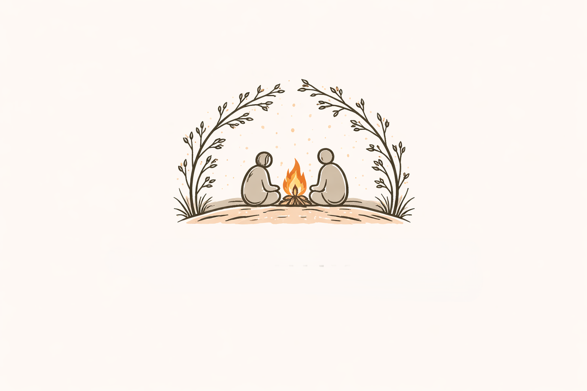

# Remainwith 🧠💬🎥

[](https://golang.org)
[](https://pion.ly)
[](https://github.com/jackc/pgx)
[](LICENSE)

Remainwith is a real-time social platform built with Go and Pion WebRTC, designed for emotional support, personal reflection, and meaningful connections. Users journal thoughts, select interests for matching, chat in groups ("campfire"), and connect via 1:1 video calls with SFU (Selective Forwarding Unit) architecture.



## ✨ Features

- **Authentication**: Secure signup/login/logout with JWT, CSRF protection, forgot/reset password (token-based).
- **Personal Journal**: Create/update/delete private entries (title + description).
- **Interests &amp; Matching**: Onboarding interest selection (emotions, goals, life situations, reflection, time states). Suggested users based on overlaps.
- **Real-time Chat**: WebSocket-powered "campfire" group chat.
- **Video Calls**: Create/join rooms, participant lists, SFU for multi-party, signaling WS.
- **Dashboard &amp; Settings**: Profile, privacy (public/private/contacts), email notifications.
- **Responsive UI**: HTML templates with static assets.

## 🛠 Quick Start

1. **Prerequisites**:
   - Go 1.25+
   - PostgreSQL 15+

2. **Clone &amp; Install**:
   ```bash
   git clone <repo> Remainwith
   cd Remainwith
   go mod tidy
   ```

3. **Environment Setup**:
   Create `.env`:
   ```
   DB_USER=postgres
   DB_PASS=yourpassword
   DB_HOST=localhost
   DB_PORT=youtport
   DB_NAME=dbname
   ```
   (See `config/conn.go` for details.)

4. **Database**:
   - Run: `go run main.go` (auto-connects, seeds interests, creates tables/cols).
   - Tables: `users`, `journal`, `interests`, `user_interests`, `password_reset_tokens`.

5. **Run Server**:
   ```bash
   go run main.go
   ```
   Open http://localhost:8080

## 📋 API Endpoints

| Method | Endpoint | Auth | Description |
|--------|----------|------|-------------|
| GET | `/` | - | Index |
| GET/POST | `/signup`, `/login` | - | Auth forms |
| GET/POST | `/forgot-password`, `/reset-password` | - | Password reset |
| GET | `/dashboard`, `/profile/`, `/settings/` | JWT | User pages |
| GET/POST | `/journal` | JWT | Journal CRUD |
| GET | `/campfire`, `/campfire/chat` | Partial | Chat pages |
| GET | `/about` | - | About |
| GET/POST | `/api/interests` | -/JWT | List/save interests |
| POST | `/api/video/create-room` | JWT | Create video room |
| POST | `/api/video/join-room` | JWT | Join room |

## 🔌 WebSockets

- `/ws`: General chat hub
- `/ws/signaling`: Video signaling
- `/ws/sfu`: SFU for video forwarding

## 🏗 Architecture

```
Remainwith/
├── main.go              # Entry, mux, middleware
├── config/conn.go       # .env, Postgres pool
├── db/db.go             # Models, CRUD, seeding
├── internal/
│   ├── handler/         # Auth, pages, API
│   ├── ws/              # Chat hub
│   ├── chat/            # Campfire
│   ├── sfu/             # Video SFU (LiveKit-inspired)
│   ├── signaling/       # WS signaling
│   └── models/          # DB structs
├── frontend/            # .tmpl, HTML, static/
├── assets/              # Logo/images
└── vendor (Pion WebRTC, QUIC)
```

- **DB Schema** (auto-managed):
  ```sql
  users: id, name, email, password, email_notifications, privacy_visibility
  journal: id, user_id, title, desc, created_at
  interests: id, name, category, is_active
  user_interests: user_id, interest_id (junction)
  password_reset_tokens: id, user_id, token_hash, expires_at
  ```

- **Deps**: Pion/webrtc v4, pgx v5, gorilla/websocket, livekit/protocol, jwt/v5.

## 🚀 Development

- **Test**: `go test ./...`
- **Build**: `go build -o remainwith`
- **Logs**: `server.log`, `server_debug.log`
- **Cleanup**: Auto (rooms/sessions every 5min)

## 🤝 Contributing

1. Fork &amp; PR.
2. Follow Go fmt: `go fmt ./...`
3. Add tests.

## 📄 License

MIT - See [LICENSE](quic/LICENSE) (or add one).

## 🙏 Acknowledgments

- [Pion WebRTC](https://pion.ly) for real-time magic.
- [LiveKit](https://livekit.io) protocol inspiration.

**Stay connected, reflect deeply. 🧠✨**

